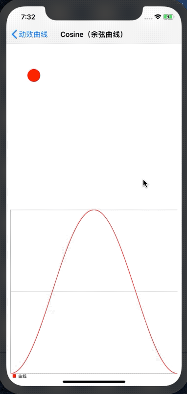

# Cosine

## Demo



## iOS 

Enumerate：GMCCurveTypeCosine

```objc
    #import <GaiaMotionCurve/CALayer+GaiaMotionCurve.h>

    CGFloat right = [[UIScreen mainScreen] bounds].size.width - 80 - 20;
    GMCModel *model = [GMCModel modelWithKeyPath:@"position.x"
                                        duration:0.75
                                           delay:0
                                       curveType:GMCCurveTypeCosine
                                       fromValue:[NSValue gmc_valueWithCGFloat:_animationView.center.x]
                                         toValue:[NSValue gmc_valueWithCGFloat:right]];
    __weak typeof(self) weakSelf = self;
    [_animationView.layer gmc_animateWithAnimationModels:@[model] completion:^(BOOL finished) {
        dispatch_after(dispatch_time(DISPATCH_TIME_NOW, (int64_t)(1 * NSEC_PER_SEC)), dispatch_get_main_queue(), ^{
            weakSelf.animationView.layer.frame = CGRectMake(80, 200, 40, 40);
        });
    }];
```

## Android

Interpolator：GaiaMotionCurveCosineInterpolator

```java
    import com.gaia.MotionCurve.*;

    View animationView = findViewById(R.id.animation_view);
    TranslateAnimation animation = new TranslateAnimation(0, 700, 0, 0);
    animation.setFillAfter(true);
    animation.setDuration(700);
    animation.setInterpolator(new GaiaMotionCurveCosineInterpolator());
    animationView.startAnimation(animation);
```

## Customizable Parameters

Configurable Parameters：

```
d:damping
c:cycles, multiples of 0.25
```

Default：

```
d = 1.0
c = 1.0
```

iOS 

```objective-c
    CGFloat right = [[UIScreen mainScreen] bounds].size.width - 80 - 20;
    GMCModel *model = [GMCModel  modelWithKeyPath:@"position.x"
                                         duration:0.75
                                            delay:0
                                        curveType:GMCCurveTypeCosine
                                       customArgs:@{@"d":@1.0,@"c":@1.0}
                                        fromValue:[NSValue gmc_valueWithCGFloat:_animationView.center.x]
                                          toValue:[NSValue gmc_valueWithCGFloat:right]];
    __weak typeof(self) weakSelf = self;
    [_animationView.layer gmc_animateWithAnimationModels:@[model] completion:^(BOOL finished) {
        dispatch_after(dispatch_time(DISPATCH_TIME_NOW, (int64_t)(1 * NSEC_PER_SEC)), dispatch_get_main_queue(), ^{
            weakSelf.animationView.layer.frame = CGRectMake(80, 200, 40, 40);
        });
    }];
```

Android

```java
    View animationView = findViewById(R.id.animation_view);
    TranslateAnimation animation = new TranslateAnimation(0, 700, 0, 0);
    animation.setFillAfter(true);
    animation.setDuration(700);
    animation.setInterpolator(new GaiaMotionCurveCosineInterpolator(1.0, 1.0));
    animationView.startAnimation(animation);
```

