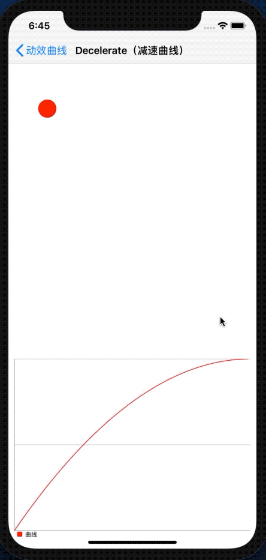

# Decelerate

## Demo



## iOS 

Enumerate：GMCCurveTypeDecelerate

```objc
    #import <GaiaMotionCurve/CALayer+GaiaMotionCurve.h>

    CGFloat right = [[UIScreen mainScreen] bounds].size.width - 80 - 20;
    GMCModel *model = [GMCModel modelWithKeyPath:@"position.x"
                                        duration:0.75
                                           delay:0
                                       curveType:GMCCurveTypeDecelerate
                                       fromValue:[NSValue gmc_valueWithCGFloat:_animationView.center.x]
                                         toValue:[NSValue gmc_valueWithCGFloat:right]];
    __weak typeof(self) weakSelf = self;
    [_animationView.layer gmc_animateWithAnimationModels:@[model] completion:^(BOOL finished) {
        dispatch_after(dispatch_time(DISPATCH_TIME_NOW, (int64_t)(1 * NSEC_PER_SEC)), dispatch_get_main_queue(), ^{
            weakSelf.animationView.layer.frame = CGRectMake(80, 200, 40, 40);
        });
    }];
```

## Android

Interpolator：GaiaMotionCurveDecelerateInterpolator

```java
    import com.gaia.MotionCurve.*;

    View animationView = findViewById(R.id.animation_view);
    TranslateAnimation animation = new TranslateAnimation(0, 700, 0, 0);
    animation.setFillAfter(true);
    animation.setDuration(700);
    animation.setInterpolator(new GaiaMotionCurveDecelerateInterpolator());
    animationView.startAnimation(animation);
```

## Customizable Parameters

Configurable Parameters：

```
x1: x coordinate of control point x1
y1: y coordinate of control point y1
x2: x coordinate of control point x2
y2: y coordinate of control point y2
```

Default：

```
x1 = 0.0
y1 = 0.0
x2 = 0.1
y2 = 1.0
```

iOS 

```objective-c
    CGFloat right = [[UIScreen mainScreen] bounds].size.width - 80 - 20;
    GMCModel *model = [GMCModel  modelWithKeyPath:@"position.x"
                                         duration:0.75
                                            delay:0
                                        curveType:GMCCurveTypeDecelerate
                                       customArgs:@{@"x1":@0.0,@"y1":@0.0,@"x2":@0.1,@"y2":@1.0}
                                        fromValue:[NSValue gmc_valueWithCGFloat:_animationView.center.x]
                                          toValue:[NSValue gmc_valueWithCGFloat:right]];
    __weak typeof(self) weakSelf = self;
    [_animationView.layer gmc_animateWithAnimationModels:@[model] completion:^(BOOL finished) {
        dispatch_after(dispatch_time(DISPATCH_TIME_NOW, (int64_t)(1 * NSEC_PER_SEC)), dispatch_get_main_queue(), ^{
            weakSelf.animationView.layer.frame = CGRectMake(80, 200, 40, 40);
        });
    }];
```

Android

```java
    View animationView = findViewById(R.id.animation_view);
    TranslateAnimation animation = new TranslateAnimation(0, 700, 0, 0);
    animation.setFillAfter(true);
    animation.setDuration(700);
    animation.setInterpolator(new GaiaMotionCurveDecelerateInterpolator(0.0, 0.0, 0.1, 1.0));
    animationView.startAnimation(animation);
```

