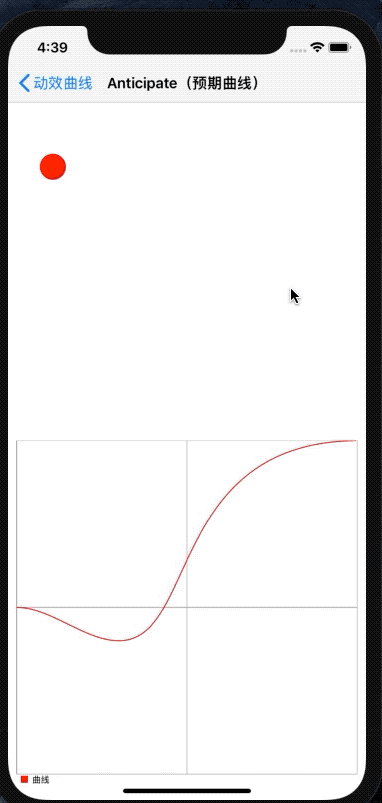

# 预期曲线

## 演示



## iOS 

枚举：GMCCurveTypeAnticipate

```objc
    #import <GaiaMotionCurve/CALayer+GaiaMotionCurve.h>

    CGFloat right = [[UIScreen mainScreen] bounds].size.width - 80 - 20;
    GMCModel *model = [GMCModel modelWithKeyPath:@"position.x"
                                        duration:0.75
                                           delay:0
                                       curveType:GMCCurveTypeAnticipate
                                       fromValue:[NSValue gmc_valueWithCGFloat:_animationView.center.x]
                                         toValue:[NSValue gmc_valueWithCGFloat:right]];
    __weak typeof(self) weakSelf = self;
    [_animationView.layer gmc_animateWithAnimationModels:@[model] completion:^(BOOL finished) {
        dispatch_after(dispatch_time(DISPATCH_TIME_NOW, (int64_t)(1 * NSEC_PER_SEC)), dispatch_get_main_queue(), ^{
            weakSelf.animationView.layer.frame = CGRectMake(80, 200, 40, 40);
        });
    }];
```

## Android

差值器：GaiaMotionCurveAnticipateInterpolator

```java
    import com.gaia.MotionCurve.*;

    View animationView = findViewById(R.id.animation_view);
    TranslateAnimation animation = new TranslateAnimation(0, 700, 0, 0);
    animation.setFillAfter(true);
    animation.setDuration(700);
    animation.setInterpolator(new GaiaMotionCurveAnticipateInterpolator());
    animationView.startAnimation(animation);
```

## 可自定义的参数

可配置的参数：

```
 d:damping的缩写，控制的是最低点的高低
x1:控制点1的x坐标
y1:控制点1的y坐标
x2:控制点2的x坐标
y2:控制点2的y坐标
x3:控制点3的x坐标
y3:控制点3的y坐标
x4:控制点4的x坐标
y4:控制点4的y坐标
```

默认值为：

```
 d = 0.2
x1 = 0.33
y1 = 0.0
x2 = 0.67
y2 = 1.0
x3 = 0.33
y3 = 0.0
x4 = 0.2
y4 = 1.0
```

iOS 

```objective-c
    CGFloat right = [[UIScreen mainScreen] bounds].size.width - 80 - 20;
    GMCModel *model = [GMCModel  modelWithKeyPath:@"position.x"
                                         duration:0.75
                                            delay:0
                                        curveType:GMCCurveTypeAnticipate
                                    customArgs:@{@"d":@0.2,@"x1":@0.33,@"y1":@0.0,@"x2":@0.67,@"y2":@1.0,
                                                 @"x3":@0.33,@"y3":@0.0,@"x4":@0.2,@"y4":@1.0}
                                        fromValue:[NSValue gmc_valueWithCGFloat:_animationView.center.x]
                                          toValue:[NSValue gmc_valueWithCGFloat:right]];
    __weak typeof(self) weakSelf = self;
    [_animationView.layer gmc_animateWithAnimationModels:@[model] completion:^(BOOL finished) {
        dispatch_after(dispatch_time(DISPATCH_TIME_NOW, (int64_t)(1 * NSEC_PER_SEC)), dispatch_get_main_queue(), ^{
            weakSelf.animationView.layer.frame = CGRectMake(80, 200, 40, 40);
        });
    }];
```

Android

```java
    View animationView = findViewById(R.id.animation_view);
    TranslateAnimation animation = new TranslateAnimation(0, 700, 0, 0);
    animation.setFillAfter(true);
    animation.setDuration(700);
    animation.setInterpolator(new GaiaMotionCurveAnticipateInterpolator(0.2,0.33,0.0,0.67,1.0,0.33,0.0,0.2,1.0));
    animationView.startAnimation(animation);
```

