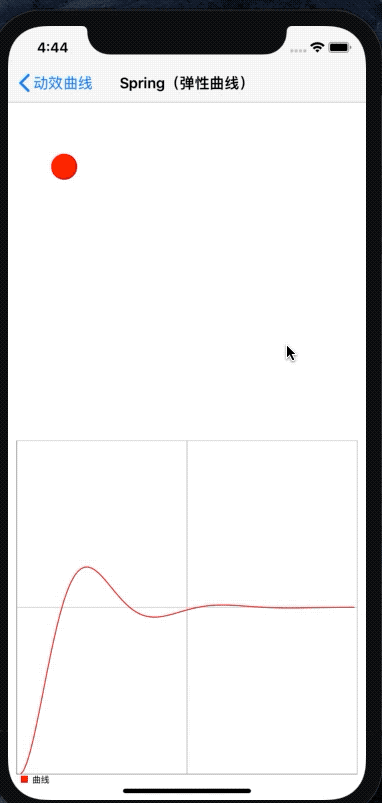

# 弹性曲线

## 演示



## iOS 

枚举：GMCCurveTypeSpring

```objc
    #import <GaiaMotionCurve/CALayer+GaiaMotionCurve.h>

    CGFloat right = [[UIScreen mainScreen] bounds].size.width - 80 - 20;
    GMCModel *model = [GMCModel modelWithKeyPath:@"position.x"
                                        duration:0.75
                                           delay:0
                                       curveType:GMCCurveTypeSpring
                                       fromValue:[NSValue gmc_valueWithCGFloat:_animationView.center.x]
                                         toValue:[NSValue gmc_valueWithCGFloat:right]];
    __weak typeof(self) weakSelf = self;
    [_animationView.layer gmc_animateWithAnimationModels:@[model] completion:^(BOOL finished) {
        dispatch_after(dispatch_time(DISPATCH_TIME_NOW, (int64_t)(1 * NSEC_PER_SEC)), dispatch_get_main_queue(), ^{
            weakSelf.animationView.layer.frame = CGRectMake(80, 200, 40, 40);
        });
    }];
```

## Android

差值器：GaiaMotionCurveSpringInterpolator

```java
    import com.gaia.MotionCurve.*;

    View animationView = findViewById(R.id.animation_view);
    TranslateAnimation animation = new TranslateAnimation(0, 700, 0, 0);
    animation.setFillAfter(true);
    animation.setDuration(700);
    animation.setInterpolator(new GaiaMotionCurveSpringInterpolator());
    animationView.startAnimation(animation);
```

## 可自定义的参数

可配置的参数：

弹性曲线支持Mass和RK4两套参数系统（Android暂时只支持Mass参数系统）

**Mass参数系统：**

```
m: mass的缩写
s: stiffness的缩写
d: damping的缩写
iv:velocity的缩写
```

默认值为：

```
m = 0.7
s = 380.0
d = 10.0
iv = -2.0
```

iOS 

```objective-c
    CGFloat right = [[UIScreen mainScreen] bounds].size.width - 80 - 20;
    GMCModel *model = [GMCModel  modelWithKeyPath:@"position.x"
                                         duration:0.75
                                            delay:0
                                        curveType:GMCCurveTypeSpring
                                       customArgs:@{@"m":@1.0,@"s":@380.0,@"d":@10.0,@"iv":@-2.0}
                                        fromValue:[NSValue gmc_valueWithCGFloat:_animationView.center.x]
                                          toValue:[NSValue gmc_valueWithCGFloat:right]];
    __weak typeof(self) weakSelf = self;
    [_animationView.layer gmc_animateWithAnimationModels:@[model] completion:^(BOOL finished) {
        dispatch_after(dispatch_time(DISPATCH_TIME_NOW, (int64_t)(1 * NSEC_PER_SEC)), dispatch_get_main_queue(), ^{
            weakSelf.animationView.layer.frame = CGRectMake(80, 200, 40, 40);
        });
    }];
```

Android

```java
    View animationView = findViewById(R.id.animation_view);
    TranslateAnimation animation = new TranslateAnimation(0, 700, 0, 0);
    animation.setFillAfter(true);
    animation.setDuration(700);
    animation.setInterpolator(new GaiaMotionCurveSpringInterpolator(0.7, 380.0, 10.0, -2.0));
    animationView.startAnimation(animation);
```

**RK4参数系统：**

```
t: tension的缩写
f: friction的缩写
v: velocity的缩写
```

默认值为：

```
t = 533.0
f = 14.0
v = -2.0
```

iOS 

```objective-c
    CGFloat right = [[UIScreen mainScreen] bounds].size.width - 80 - 20;
    GMCModel *model = [GMCModel  modelWithKeyPath:@"position.x"
                                         duration:0.75
                                            delay:0
                                        curveType:GMCCurveTypeSpring
                                       customArgs:@{@"t":@533.0,@"f":@14.0,@"v":@-2.0}
                                        fromValue:[NSValue gmc_valueWithCGFloat:_animationView.center.x]
                                          toValue:[NSValue gmc_valueWithCGFloat:right]];
    __weak typeof(self) weakSelf = self;
    [_animationView.layer gmc_animateWithAnimationModels:@[model] completion:^(BOOL finished) {
        dispatch_after(dispatch_time(DISPATCH_TIME_NOW, (int64_t)(1 * NSEC_PER_SEC)), dispatch_get_main_queue(), ^{
            weakSelf.animationView.layer.frame = CGRectMake(80, 200, 40, 40);
        });
    }];
```

